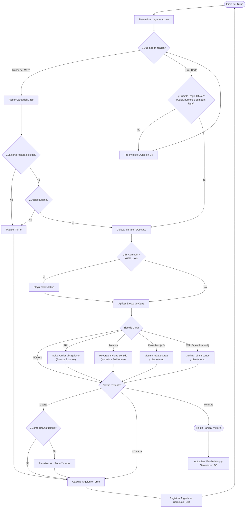
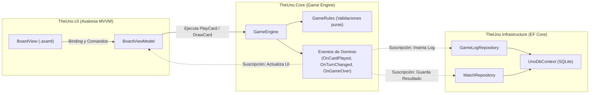

# Diagramas del Sistema - TheUno

## 1. Diagrama de Flujo del Turno y Reglas Oficiales

```mermaid
flowchart TD
    Start(["Inicio del Turno"]) --> CheckActive["Determinar Jugador Activo"]
    CheckActive --> Choice{"¿Qué acción realiza?"}

    %% Robo de carta
    Choice -->|"Robar del Mazo"| DrawCard["Robar Carta del Mazo"]
    DrawCard --> CanPlayDrawn{"¿La carta robada es legal?"}
    CanPlayDrawn -->|"No"| PassTurn["Pasa el Turno"]
    CanPlayDrawn -->|"Sí"| PlayDrawnDecision{"¿Decide jugarla?"}
    PlayDrawnDecision -->|"No"| PassTurn
    PlayDrawnDecision -->|"Sí"| ProcessPlay

    %% Tirar carta
    Choice -->|"Tirar Carta"| ValidateRule{"¿Cumple Regla Oficial?<br/>(Color, número o comodín legal)"}
    ValidateRule -->|"No"| InvalidPlay["Tiro Inválido (Aviso en UI)"]
    InvalidPlay --> Choice
    ValidateRule -->|"Sí"| ProcessPlay["Colocar carta en Descarte"]

    ProcessPlay --> IsWild{"¿Es Comodín?<br/>(Wild o +4)"}
    IsWild -->|"Sí"| PickColor["Elegir Color Activo"]
    IsWild -->|"No"| ApplyEffects
    PickColor --> ApplyEffects["Aplicar Efecto de Carta"]

    %% Efectos
    ApplyEffects --> CardAction{"Tipo de Carta"}
    CardAction -->|"Número"| CheckHandCount
    CardAction -->|"Skip"| SkipTurn["Salto: Omitir al siguiente<br/>(Avanza 2 turnos)"]
    CardAction -->|"Reverse"| ReverseDir["Reversa: Invierte sentido<br/>(Horario a Antihorario)"]
    CardAction -->|"Draw Two (+2)"| VictimDraw2["Víctima roba 2 cartas<br/>y pierde turno"]
    CardAction -->|"Wild Draw Four (+4)"| VictimDraw4["Víctima roba 4 cartas<br/>y pierde turno"]

    SkipTurn --> CheckHandCount
    ReverseDir --> CheckHandCount
    VictimDraw2 --> CheckHandCount
    VictimDraw4 --> CheckHandCount

    %% Regla de UNO y Victoria
    CheckHandCount{"Cartas restantes"}
    CheckHandCount -->|"1 carta"| UnoCheck{"¿Cantó UNO a tiempo?"}
    UnoCheck -->|"Sí"| NextTurn["Calcular Siguiente Turno"]
    UnoCheck -->|"No"| UnoPenalty["Penalización: Roba 2 cartas"]
    UnoPenalty --> NextTurn

    CheckHandCount -->|"> 1 carta"| NextTurn
    PassTurn --> NextTurn

    NextTurn --> LogTurnEvent["Registrar Jugada en GameLog (DB)"]
    LogTurnEvent --> Start

    CheckHandCount -->|"0 cartas"| GameOver(["Fin de Partida: Victoria"])
    GameOver --> SaveFinalMatch["Actualizar MatchHistory y Ganador en DB"]
```

---

## 2. Diagrama de Arquitectura y Comunicación entre Capas

```mermaid
flowchart LR
    subgraph UI ["TheUno.UI (Avalonia MVVM)"]
        View["BoardView (.axaml)"]
        VM["BoardViewModel"]
        View -->|"Binding y Comandos"| VM
    end

    subgraph Core ["TheUno.Core (Game Engine)"]
        Engine["GameEngine"]
        Rules["GameRules (Validaciones puras)"]
        Events["Eventos de Dominio<br/>(OnCardPlayed, OnTurnChanged, OnGameOver)"]
        Engine --> Rules
        Engine --> Events
    end

    subgraph Infra ["TheUno.Infrastructure (EF Core)"]
        DbContext["UnoDbContext (SQLite)"]
        LogRepo["GameLogRepository"]
        MatchRepo["MatchRepository"]
        LogRepo --> DbContext
        MatchRepo --> DbContext
    end

    %% Relaciones
    VM -->|"Ejecuta PlayCard / DrawCard"| Engine
    Events -.->|"Suscripción: Actualiza UI"| VM
    Events -.->|"Suscripción: Inserta Log"| LogRepo
    Events -.->|"Suscripción: Guarda Resultado"| MatchRepo
```